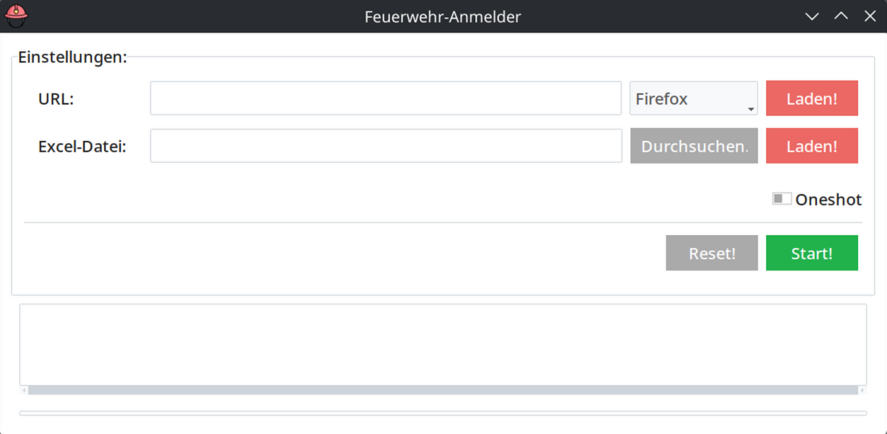

# Feuerwehr Anmelder
Kleines Stück Software, um "automatisiert" Online-Formulare für große Mengen an Anmeldungen umzusetzen.
Daten werden erfasst in Excel und in einen Browser übertragen mit Python & Selenium.

Feuerwehr-Helm Icon von 

